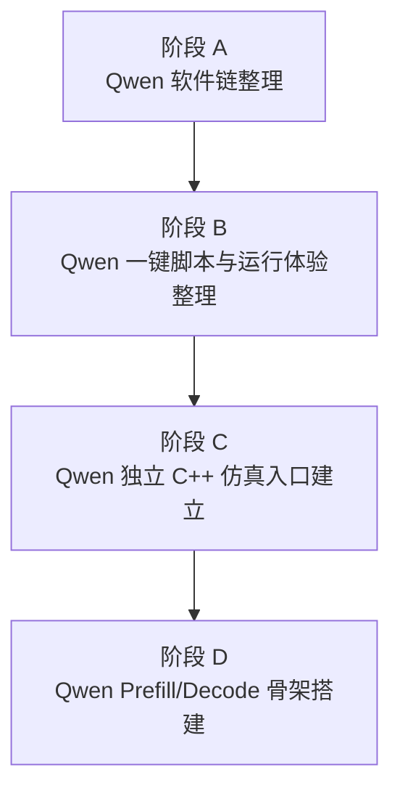
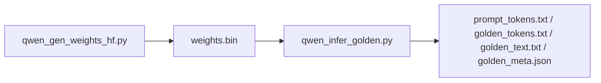
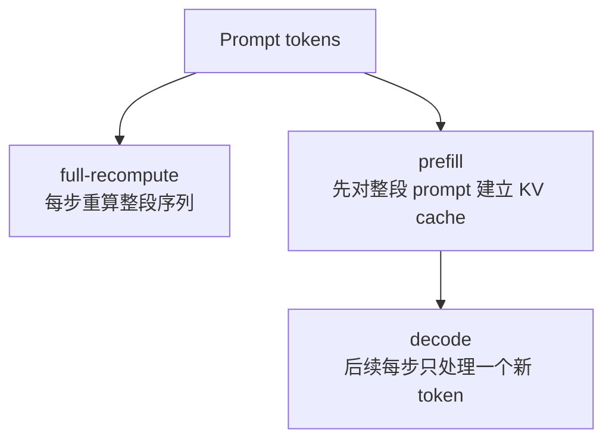
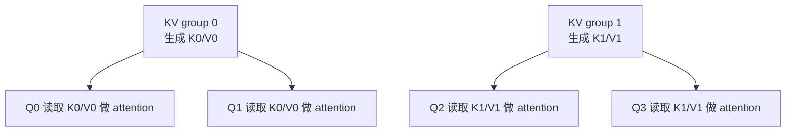
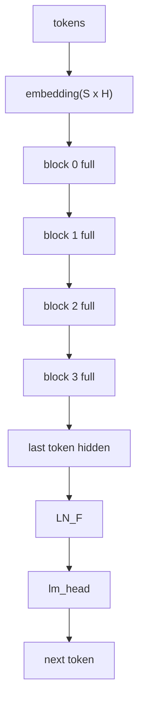
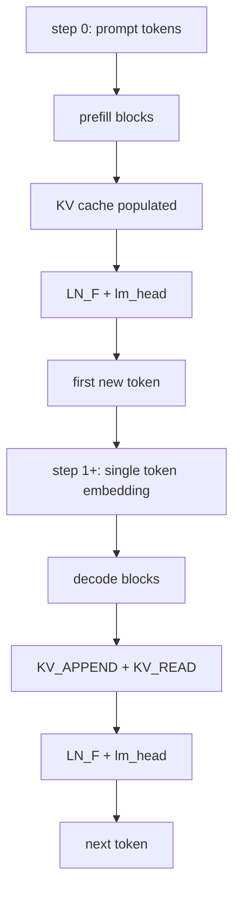

# Qwen 路线重构与 Prefill/Decode 改造记录

这份文档记录当前 Qwen 路线从“单脚本可跑 demo”整理到“软件链清晰、Qwen 独立仿真入口具备 KV-cache 骨架”的整个过程。

文档覆盖三部分内容：

- 已完成的工作：从 Python 脚本整理，到 `run_qwen_demo.sh`，到 `qwen_demo_infer` 独立目标
- 当前进行到的工作：Qwen `prefill + decode` 的 C++/微码骨架
- 后续待做的工作：把 `--kv-cache` 主流程真正接通，并继续验证数值一致性

如果你只想快速看当前结论，可以先看：

- [README.md](../README.md)
- [sim/verilator/run_qwen_demo.sh](../sim/verilator/run_qwen_demo.sh)
- [sim/verilator/tb_qwen_demo_infer.cpp](../sim/verilator/tb_qwen_demo_infer.cpp)

# 1. 目标与边界

这轮工作一开始就明确了几个边界：

- 不改 RTL 主骨架
- 不扩大 `VOCAB_SIZE`
- 不宣称“完整真实 Qwen tokenizer 支持”
- 不先拆独立子仓库
- 优先把 Qwen 软件链和仿真链整理清楚

这轮工作的总体目标可以分成两段：

1. 先把当前 Qwen 路线整理成和 GPT 类似的“权重脚本”和“golden/infer 脚本”分层
2. 再把 Qwen C++ 仿真从“只有 full-recompute”推进到“具备 full-recompute 与 prefill/decode 双路径骨架”

# 2. 总体过程

可以把当前这次改造看成 4 个阶段：

其中：

- 阶段 A 解决“Qwen 软件前后处理职责不清”的问题
- 阶段 B 解决“Qwen 没有像 GPT 一样的一键运行入口”的问题
- 阶段 C 解决“Qwen 仍挂在 llama 命名与单路径入口上”的问题
- 阶段 D 解决“Qwen 只有 full-recompute，没有 KV-cache 路径骨架”的问题

# 3. 当前任务总表

| 阶段 | 任务 | 目标 | 当前状态 | 关键文件 |
| --- | --- | --- | --- | --- |
| A1 | 抽出 Qwen 高层 golden/infer 脚本 | 让文本前处理、后处理、输出工件脱离权重脚本 | 已完成 | [python/golden/qwen_infer_golden.py](../python/golden/qwen_infer_golden.py) |
| A2 | 收窄 Qwen 权重脚本职责 | 让 `qwen_gen_weights_hf.py` 只负责权重导出/裁剪/量化/打包 | 已完成 | [python/tools/qwen_gen_weights_hf.py](../python/tools/qwen_gen_weights_hf.py) |
| B1 | 新增 Qwen demo 运行脚本 | 提供与 GPT 类似的一键入口 | 已完成 | [sim/verilator/run_qwen_demo.sh](../sim/verilator/run_qwen_demo.sh) |
| B2 | 校验新 Qwen 两段式流程 | 确认 `weights -> golden -> NPU` 路径可跑通 | 已完成 | [python/golden/qwen_infer_golden.py](../python/golden/qwen_infer_golden.py), [sim/verilator/build/qwen_demo_infer](../sim/verilator/build/qwen_demo_infer) |
| C1 | 备份现有 LLaMA 入口与 CMake | 保护基线，避免直接污染稳定路径 | 已完成 | [sim/verilator/tb_llama_demo_infer.cpp.bak](../sim/verilator/tb_llama_demo_infer.cpp.bak), [sim/verilator/CMakeLists.txt.bak](../sim/verilator/CMakeLists.txt.bak) |
| C2 | 复制出 Qwen 独立仿真入口 | 建立 `qwen` 命名的 C++ 入口 | 已完成 | [sim/verilator/tb_qwen_demo_infer.cpp](../sim/verilator/tb_qwen_demo_infer.cpp) |
| C3 | 新增 `qwen_demo_infer` target | 让 Qwen 有独立可执行目标 | 已完成 | [sim/verilator/CMakeLists.txt](../sim/verilator/CMakeLists.txt) |
| C4 | 加入 `--kv-cache` 参数骨架 | 为后续双路径切换建立框架 | 已完成 | [sim/verilator/tb_qwen_demo_infer.cpp](../sim/verilator/tb_qwen_demo_infer.cpp) |
| D1 | 设计 Qwen decode SRAM 地址布局 | 为 decode 模式划出独立激活区 | 已完成 | [sim/verilator/tb_qwen_demo_infer.cpp](../sim/verilator/tb_qwen_demo_infer.cpp) |
| D2 | 补 decode 数据装载/读回 helper | 为未来单 token 路径准备接口 | 已完成 | [sim/verilator/tb_qwen_demo_infer.cpp](../sim/verilator/tb_qwen_demo_infer.cpp) |
| D3 | 补 Qwen prefill 微码骨架 | 建立完整 prefill block 微码框架 | 已完成 | [sim/verilator/tb_qwen_demo_infer.cpp](../sim/verilator/tb_qwen_demo_infer.cpp) |
| D4 | 补 Qwen decode 微码骨架 | 建立完整 decode block 微码框架 | 已完成 | [sim/verilator/tb_qwen_demo_infer.cpp](../sim/verilator/tb_qwen_demo_infer.cpp) |
| D5 | 将 attention loop 改成按 `kv_h` 分组 | 显式表达 GQA 共享关系 | 已完成 | [sim/verilator/tb_qwen_demo_infer.cpp](../sim/verilator/tb_qwen_demo_infer.cpp) |
| E1 | 接通 `--kv-cache` 的 prefill 主流程 | 让 `use_kv_cache` 分支真正开始执行 | 已完成（代码已接通） | [sim/verilator/tb_qwen_demo_infer.cpp](../sim/verilator/tb_qwen_demo_infer.cpp) |
| E2 | 接通 `--kv-cache` 的 decode 主流程 | 跑单 token decode block 链 | 已完成（代码已接通） | [sim/verilator/tb_qwen_demo_infer.cpp](../sim/verilator/tb_qwen_demo_infer.cpp) |
| E3 | 增加 KV 路径验证与对照 | 比较 full-recompute 与 prefill/decode 的一致性 | 待确认（曾反馈测试通过，待分别留档） | [sim/verilator/tb_qwen_demo_infer.cpp](../sim/verilator/tb_qwen_demo_infer.cpp) |
| E4 | 更新 `run_qwen_demo.sh` 支持 `--kv-cache` | 把新模式透传到 Qwen 独立目标 | 已完成 | [sim/verilator/run_qwen_demo.sh](../sim/verilator/run_qwen_demo.sh) |

# 4. 阶段 A：Qwen 软件链整理

## 4.1 初始问题

最初的 Qwen 路线有这些问题：

- [python/tools/qwen_gen_weights_hf.py](../python/tools/qwen_gen_weights_hf.py) 同时承担：
  - 下载权重
  - 裁剪
  - 量化
  - 打包
  - 跑 golden
  - 写输出工件
- `prompt` 语义不清，容易误解成“真实文本 prompt”
- 缺少像 GPT 那样更清晰的前后处理层

## 4.2 采取的改造

这一阶段的核心做法是把职责拆开：

- [python/tools/qwen_gen_weights_hf.py](../python/tools/qwen_gen_weights_hf.py)
  - 保留为“权重脚本”
  - 负责下载、裁剪、量化、打包 `weights.bin`

- [python/golden/qwen_infer_golden.py](../python/golden/qwen_infer_golden.py)
  - 新增为“高层 Qwen golden/infer driver”
  - 负责：
    - 文本 `prompt` 前处理
    - `text <-> tiny token ids` 映射
    - 调用共享数值内核
    - 输出 `prompt_tokens.txt`
    - 输出 `golden_tokens.txt`
    - 输出 `golden_text.txt`
    - 输出 `golden_logits.bin`
    - 输出 `golden_meta.json`

## 4.3 当前结果

当前 Qwen 软件链已经具备两层分工：

也就是说：

- 权重脚本不再直接跑 golden
- golden 脚本不再负责权重导出
- Qwen 现在和 GPT 的职责分层更接近

# 5. 阶段 B：Qwen 一键运行脚本

## 5.1 初始目标

用户希望 Qwen 也有一条像 GPT `run_demo.sh` 那样的使用链路，但不要求内部实现完全相同。

## 5.2 采取的改造

新增：

- [sim/verilator/run_qwen_demo.sh](../sim/verilator/run_qwen_demo.sh)

这个脚本的职责是串起：

1. Qwen 权重脚本
2. Qwen golden/infer 脚本
3. Verilator C++ 仿真可执行文件
4. 输出工件与文本化结果

它与 GPT 的 `run_demo.sh` 一致的地方：

- 统一参数入口
- 统一 `outdir`
- 分阶段日志
- 支持跳过 Python 阶段的模式

它与 GPT 不同的地方：

- Qwen 走的是自己的权重脚本与 golden 脚本
- 后续硬件入口也会切到自己的 `qwen_demo_infer`

## 5.3 当前结果

Qwen 现在已经具备一条独立的 demo 脚本路线：

- [sim/verilator/run_qwen_demo.sh](../sim/verilator/run_qwen_demo.sh)

这一阶段的目标已经完成。

# 6. 阶段 C：Qwen 独立仿真入口建立

## 6.1 初始目标

虽然软件脚本已经独立了，但 C++ 仿真入口仍然挂在：

- [sim/verilator/tb_llama_demo_infer.cpp](../sim/verilator/tb_llama_demo_infer.cpp)

为了后续做 Qwen 的 `prefill + decode` 改造，不应该继续直接硬改 `llama` 入口。

## 6.2 备份与分叉

先做了基线保护：

- [sim/verilator/tb_llama_demo_infer.cpp.bak](../sim/verilator/tb_llama_demo_infer.cpp.bak)
- [sim/verilator/CMakeLists.txt.bak](../sim/verilator/CMakeLists.txt.bak)

再复制出新的 Qwen 专用入口：

- [sim/verilator/tb_qwen_demo_infer.cpp](../sim/verilator/tb_qwen_demo_infer.cpp)

## 6.3 新 target

在：

- [sim/verilator/CMakeLists.txt](../sim/verilator/CMakeLists.txt)

里新增了独立 target：

- `qwen_demo_infer`

这样后续就可以做到：

- `llama_demo_infer` 保留稳定 baseline
- `qwen_demo_infer` 单独演进 KV-cache 路径

## 6.4 当前结果

当前已经完成：

- Qwen 独立 C++ 入口
- Qwen 独立 CMake target
- 独立 banner / VCD 文件名 / PASS 文案

也就是说，Qwen 的硬件入口已经不再只是“换个数据目录跑 llama”。

# 7. 阶段 D：Qwen Prefill/Decode 骨架

## 7.1 初始状态

当前 Qwen 路线最初只有一条路径：

- `full-recompute`

也就是每生成一个新 token，都重新对整段序列做一次完整 block 计算。

## 7.2 加入 `--kv-cache` 参数骨架

在：

- [sim/verilator/tb_qwen_demo_infer.cpp](../sim/verilator/tb_qwen_demo_infer.cpp)

里已经加入：

- `--kv-cache`

当前行为是：

- 不带 `--kv-cache`：继续走当前 full-recompute
- 带 `--kv-cache`：明确报“路径尚未接通”

这样做的目的，是先把模式切换框架建立起来，而不误导用户认为 KV 路径已经完成。

### 7.2.1 当前两种运行模式

到目前为止，Qwen C++ 仿真已经具备两种运行模式：

1. `full-recompute`
2. `prefill + decode (--kv-cache)`

这两种模式的高层差异如下：

| 模式 | 第一个新 token | 后续新 token | KV cache 是否参与 | 当前用途 |
| --- | --- | --- | --- | --- |
| `full-recompute` | 对完整 prompt 跑所有 block，再取最后一个位置的 logits | 每一步都重新对完整序列执行所有 block | 否 | 稳定 baseline，与当前既有 Qwen 路线完全兼容 |
| `prefill + decode` | 第一步先做 `prefill`，对完整 prompt 跑 block，并建立 KV cache | 后续每步只对单 token 做 `decode` | 是 | 复用 KV cache，验证 Qwen 路线的 decode 形态 |

可以把两者的主流程关系简化成：

其中：

- `full-recompute` 更适合作为“是否退化”的基准
- `prefill + decode` 更接近真正部署时的自回归解码形态

## 7.3 设计 decode SRAM 地址布局

为了 future decode path，已经在 `tb_qwen_demo_infer.cpp` 中加入一组 Qwen 专用 decode 地址常量，主要覆盖：

- 单 token 输入
- `RMS1_OUT`
- `Q`
- `K_NEW`
- `V_NEW`
- `K_CACHE`
- `V_CACHE`
- score / prob / context
- `WO_OUT`
- `RMS2_OUT`
- `FFN_GATE`
- `FFN_UP`
- `FFN_DOWN`
- `X_OUT`

这部分的作用是：

- 不污染 full-recompute 的现有地址区
- 为后续 decode 微码和 helper 提供稳定地址基线

### 7.3.1 Qwen decode SRAM0 布局表

当前 decode 模式使用的是一段独立的 SRAM0 激活区，起始地址为 `0xA000`。布局如下：

| 符号 | 地址 | 形状 / 字节数 | 作用 |
| --- | --- | --- | --- |
| `ADDR_QWEN_DEC_X` | `0xA000` | `[1, 64] / 64B` | decode 单 token 输入隐藏态 |
| `ADDR_QWEN_DEC_RMS1_OUT` | `0xA040` | `[1, 64] / 64B` | 第一层 `RMSNorm` 输出 |
| `ADDR_QWEN_DEC_Q_H` | `0xA080` | `[1, 16] / 16B` | 当前 `Q head` 的 `Q` 向量 |
| `ADDR_QWEN_DEC_K_NEW` | `0xA090` | `[1, 16] / 16B` | 当前 token 新生成的 `K` |
| `ADDR_QWEN_DEC_V_NEW` | `0xA0A0` | `[1, 16] / 16B` | 当前 token 新生成的 `V` |
| `ADDR_QWEN_DEC_K_CACHE` | `0xA0B0` | `[MAX_SEQ, 16] / 256B` | 从 KV cache 读回的一整段 `K` |
| `ADDR_QWEN_DEC_V_CACHE` | `0xA1B0` | `[MAX_SEQ, 16] / 256B` | 从 KV cache 读回的一整段 `V` |
| `ADDR_QWEN_DEC_S` | `0xA2B0` | `[1, MAX_SEQ] / 16B` | attention score |
| `ADDR_QWEN_DEC_P` | `0xA2C0` | `[1, MAX_SEQ] / 16B` | softmax 概率 |
| `ADDR_QWEN_DEC_ATTN_H` | `0xA2D0` | `[1, 16] / 16B` | 单个 `Q head` 的 attention 输出 |
| `ADDR_QWEN_DEC_ATTN` | `0xA2E0` | `[1, 64] / 64B` | 4 个 `Q head` 拼接后的 attention 输出 |
| `ADDR_QWEN_DEC_WO_OUT` | `0xA320` | `[1, 64] / 64B` | `Wo` 投影输出 |
| `ADDR_QWEN_DEC_X2` | `0xA360` | `[1, 64] / 64B` | 第一处 residual add 之后的结果 |
| `ADDR_QWEN_DEC_RMS2_OUT` | `0xA3A0` | `[1, 64] / 64B` | 第二层 `RMSNorm` 输出 |
| `ADDR_QWEN_DEC_FFN_GATE` | `0xA3E0` | `[1, 128] / 128B` | `SwiGLU gate` 路径输出 |
| `ADDR_QWEN_DEC_FFN_UP` | `0xA460` | `[1, 128] / 128B` | `SwiGLU up` 路径输出 |
| `ADDR_QWEN_DEC_FFN_DOWN` | `0xA4E0` | `[1, 64] / 64B` | `W_down` 输出 |
| `ADDR_QWEN_DEC_X_OUT` | `0xA520` | `[1, 64] / 64B` | decode block 最终输出 |

设计上有两个考虑：

- `K_CACHE / V_CACHE` 用连续空间保存整段历史，方便 `KV_READ` 后直接参与 GEMM
- `FFN_GATE / FFN_UP / FFN_DOWN` 单独留出空间，是因为 Qwen 这里用的是 `SwiGLU`，不是 GPT-2 那种单路 FFN

## 7.4 decode helper

已经补了两个 helper：

- `load_qwen_decode_block_to_srams(...)`
- `read_qwen_decode_block_output(...)`

作用分别是：

- 装载 decode 单 token 的 block 输入、权重和辅助表
- 从 decode 输出区域读回 block 输出

### 7.4.1 helper 的职责边界

这两个 helper 的职责边界是明确的：

- `load_qwen_decode_block_to_srams(...)`
  - 装载当前 block 所需权重
  - 写入单 token 输入到 `ADDR_QWEN_DEC_X`
  - 写入 `RMSNorm gamma`
  - 写入 `RoPE` 查表
  - 写入 decode 模式下需要的残差源
  - 如果有 QKV bias，则按 decode 单行布局写到 SRAM1

- `read_qwen_decode_block_output(...)`
  - 只负责从 `ADDR_QWEN_DEC_X_OUT` 读出 `[1, 64]` 的 block 输出

它们不负责：

- 组织 `prefill` / `decode` 的高层控制流
- 直接执行微码
- 做 token 选择或 golden 校验

## 7.5 prefill / decode 微码骨架

当前已经补齐两个未来主函数：

- `gen_qwen_prefill_block_microcode(...)`
- `gen_qwen_decode_block_microcode(...)`

这两个函数虽然还没接入 `main()`，但内部结构已经不再是空壳，而是具备完整阶段划分：

- `RMSNorm`
- `Q/K/V GEMM`
- `QKV bias`
- `RoPE`
- `KV_APPEND`
- `KV_READ`
- attention
- `WO`
- residual
- `RMSNorm 2`
- `SwiGLU FFN`
- `END`

### 7.5.1 prefill 微码的职责

`gen_qwen_prefill_block_microcode(...)` 对应的是：

- 输入是一整段 prompt 的 block 输入 `[S, HIDDEN]`
- 输出是一整段 block 输出 `[S, HIDDEN]`
- 同时在执行过程中，把每个 `kv_h` 对应的 `K/V` 通过 `KV_APPEND` 写入硬件 KV cache

可以把它理解成：

- 数学上仍然是“完整 block 前向”
- 只是比 `full-recompute` 额外多了一步“顺手把 K/V 建 cache”

### 7.5.2 decode 微码的职责

`gen_qwen_decode_block_microcode(...)` 对应的是：

- 输入是当前时刻单 token 的隐藏态 `[1, HIDDEN]`
- 对每个 `kv_h` 生成当前 token 的 `K_NEW / V_NEW`
- 通过 `KV_APPEND` 写入 cache
- 再通过 `KV_READ` 读回 `[0..T]` 范围的历史 `K/V`
- 对组内每个 `Q head` 分别完成 attention
- 最终输出单 token 的 block 输出 `[1, HIDDEN]`

它与 prefill 的区别不是“数学公式变了”，而是：

- attention 的时间维从整段 `S x S` 变成了单行 `1 x T_len`
- `K/V` 的来源不再只是当前 block 的中间结果，还包括硬件 KV cache

## 7.6 GQA attention loop 的重构

这一阶段中间做过一次重要重构。

### 第一版问题

最开始的骨架写法是：

- 外层按 `Q head` 循环
- 通过“每组共享 KV 的第一个 `Q head`”来触发 `K/V` 计算与 `KV_APPEND/KV_READ`

这种写法逻辑上可以表达共享关系，但不够直观，容易让人误以为某个 `Q head` 在“代表整个组”工作。

### 当前写法

现在已经改成：

- 外层按 `kv_h` 分组
- 先计算该组共享的 `K/V`
- 再在组内分别处理每个 `Q head`

当前 tiny Qwen 的 GQA 关系是：

- `Q0 -> KV group 0`
- `Q1 -> KV group 0`
- `Q2 -> KV group 1`
- `Q3 -> KV group 1`

因此现在的 `prefill/decode` 结构更接近真实语义：

这样读代码时，会更清楚“谁共享什么”，而不是把共享关系藏在 `first_q_for_kv` 这种控制分支里。

### 7.6.1 当前 GQA 映射关系

当前 tiny Qwen 配置为：

- `N_Q_HEADS = 4`
- `N_KV_HEADS = 2`
- `GQA_RATIO = 2`

因此 `Q head` 与 `KV group` 的映射关系为：

| Q head | 读取的 KV group |
| --- | --- |
| `Q0` | `KV group 0` |
| `Q1` | `KV group 0` |
| `Q2` | `KV group 1` |
| `Q3` | `KV group 1` |

也就是说：

- `Q` 是每个 `Q head` 独立生成和独立参与 attention 的
- `K/V` 是按组共享的

这也是为什么当前实现里，`prefill` 和 `decode` 的微码都改成了：

1. 先按 `kv_h` 生成一份共享的 `K/V`
2. 再在组内依次处理多个 `Q head`

### 7.6.2 为什么按 `kv_h` 分组更合适

这种写法的好处主要有三点：

- 它直接把 GQA 的共享关系体现在代码结构里，而不是体现在控制分支里
- 它避免出现“某个 `Q head` 代替整组执行 KV 操作”的阅读误导
- 它更贴近后续做 block 级 full-vs-kv 对照时的思维模型

换句话说，这种写法不是为了少写几条指令，而是为了让实现与概念模型一致。

## 7.7 两种模式的代码执行流程

这一节从 C++ testbench 的高层调度角度，说明当前两种模式的执行顺序。

### 7.7.1 full-recompute 流程

`full-recompute` 的每一步生成，流程都是：

1. 读取当前完整 `tokens`
2. 用 `wte` 计算整段 embedding
3. 对每个 block：
   - `load_block_to_srams(...)`
   - `gen_block_microcode(...)`
   - `run_until_done()`
   - `read_block_output(...)`
4. 取最后一个位置的隐藏态
5. 跑 `LN_F`
6. 跑 `lm_head`
7. 选出下一个 token
8. 把这个 token 追加到 `tokens`

可以简化表示为：

### 7.7.2 prefill + decode 流程

当前接入的 `--kv-cache` 路径采用的是：

- `step 0` 做 `prefill`
- `step >= 1` 做 `decode`

也就是说，第一步和后续步骤并不完全一样。

#### `step 0`: prefill

1. 读取当前完整 prompt tokens
2. 计算整段 embedding
3. 对每个 block：
   - `load_block_to_srams(...)`
   - `gen_qwen_prefill_block_microcode(...)`
   - `run_until_done()`
   - `read_block_output(...)`
4. 在每个 block 内部，微码会同时：
   - 做完整 block 计算
   - 为每个 `kv_h` 执行 `KV_APPEND`
5. 取最后一个位置隐藏态
6. 跑 `LN_F + lm_head`
7. 选出第一个新 token

#### `step >= 1`: decode

1. 只取最新生成的那个 token
2. 用 `wte` 得到单 token embedding
3. 对每个 block：
   - `load_qwen_decode_block_to_srams(...)`
   - `gen_qwen_decode_block_microcode(...)`
   - `run_until_done()`
   - `read_qwen_decode_block_output(...)`
4. 在每个 block 内部，微码会：
   - 生成当前 token 的 `K_NEW / V_NEW`
   - 通过 `KV_APPEND` 追加到 cache
   - 用 `KV_READ` 读回历史 `K/V`
   - 对当前 token 做 attention
5. 取当前 token 的 block 最终输出
6. 跑 `LN_F + lm_head`
7. 选出下一个 token

可以简化表示为：

### 7.7.3 当前主流程接线位置

当前高层模式切换发生在：

- [sim/verilator/tb_qwen_demo_infer.cpp](../sim/verilator/tb_qwen_demo_infer.cpp)

也就是：

- `if (use_kv_cache)` 进入 `prefill + decode`
- `else` 继续走 `full-recompute`

从职责划分上看：

- 微码函数负责“一个 block 内怎么跑”
- `main()` 里的模式分支负责“多步生成时用哪种 block 路径”

## 7.8 当前状态总结

这一阶段目前已经完成：

- `--kv-cache` 模式框架
- decode SRAM map
- decode helper
- prefill 微码骨架
- decode 微码骨架
- GQA 按 `kv_h` 分组的 attention loop 重构
- `use_kv_cache` 分支中 prefill 主流程接线
- `use_kv_cache` 分支中 decode 主流程接线
- `run_qwen_demo.sh` 对 `qwen_demo_infer --kv-cache` 的透传

当前已知状态：

- 相关代码已经编译通过
- `full-recompute` 路径已手动测试通过
- `prefill + decode (--kv-cache)` 路径已手动测试通过

这一阶段后续还没有完成的是：

- 对接通后的 `prefill/decode` 主流程做系统级运行验证
- 增加与 full-recompute 路径的显式对照与一致性检查

# 8. 当前代码状态

当前 Qwen 路线可以分成两部分看。

## 8.1 已经稳定可用的部分

- Qwen 权重脚本分层
- Qwen golden/infer 脚本
- Qwen demo shell 脚本
- Qwen 独立 C++ 仿真入口
- Qwen full-recompute 路径

这些部分已经可以支撑当前 Qwen 的基本 demo 与回归。

## 8.2 已经接通、正式验证待分别留档的部分

- `gen_qwen_prefill_block_microcode(...)`
- `gen_qwen_decode_block_microcode(...)`
- `load_qwen_decode_block_to_srams(...)`
- `read_qwen_decode_block_output(...)`
- `--kv-cache` 分支主流程
- `run_qwen_demo.sh` 对 `qwen_demo_infer --kv-cache` 的透传

这些部分已经完成代码接线并通过编译。此前曾反馈 `full-recompute` 与 `prefill + decode` 两条路径手动测试通过，但当前没有分别保存两种模式的命令、参数和结果，因此正式验证状态保留为待确认。

# 9. 接下来要做什么

当前最合理的后续顺序是：

## 9.1 第一优先级

继续补充更系统的 KV 路径对照验证：

1. `prefill` 输出与 full-recompute 的 block 级比较
2. `decode` 输出与 full-recompute 的 block / logits 级比较
3. 更长 token 序列下的稳定性验证

这一阶段的目标是：

- 不只是“能跑”
- 还要把 `prefill + decode` 与 full-recompute 的一致性验证补完整

## 9.2 第二优先级

增加 full-recompute 与 KV 路径的比较逻辑，包括：

- block 输出比较
- 最终 logits 比较
- token 选择对比

## 9.3 第三优先级

更新：

- [sim/verilator/run_qwen_demo.sh](../sim/verilator/run_qwen_demo.sh)

让它支持：

- `--kv-cache`

并透传到：

- `qwen_demo_infer`

## 9.4 第四优先级

视需要扩展 Python golden，使其未来也能表达：

- full-recompute
- prefill + decode

但这不是当前最前面的阻塞项。

# 10. 当前结论

到目前为止，Qwen 路线已经从：

- 复用 `llama` 入口
- full-recompute only
- 软件前后处理职责混杂

推进到了：

- 软件链分层清楚
- 具备 `run_qwen_demo.sh`
- 具备 `qwen_demo_infer`
- 具备 `--kv-cache` 模式骨架
- 具备 `prefill/decode` 的 helper、地址布局和微码主结构

当前还差的不是“把路径接起来”，因为这一步已经完成；当前更关键的是：

- 继续补齐 full-recompute 与 `prefill + decode` 的系统级对照验证
- 视需要补更多自动化测试与 README / docs 收尾

这意味着当前工程已经从“搭结构”进入了“验证与打磨”阶段。
