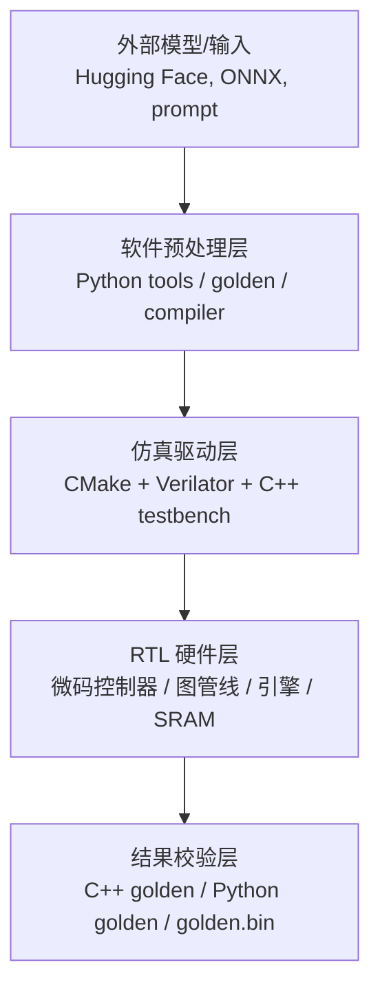
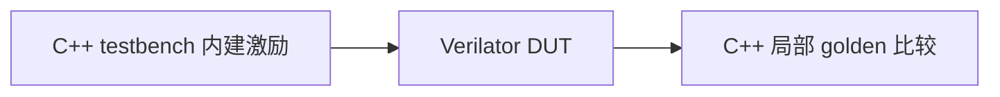
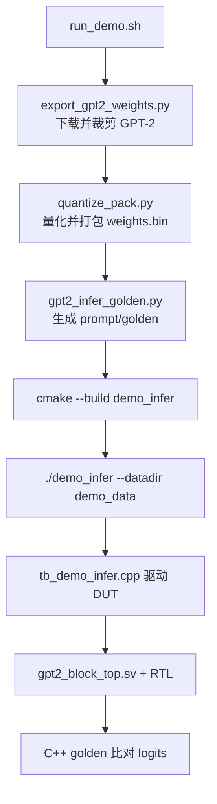
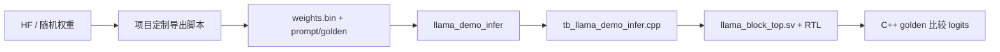
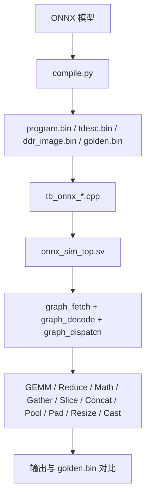
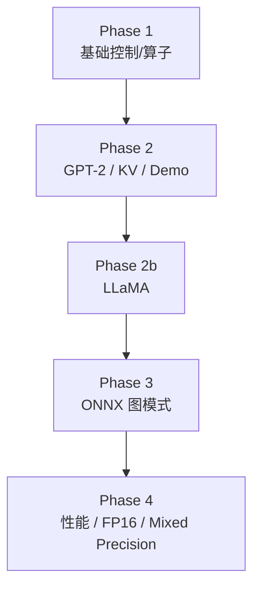

# 仿真全流程说明

这份文档面向“我想看懂这个项目从软件到硬件到底是怎么跑起来的”这个目标，覆盖：

- 环境准备
- 不同类型 case 的输入工件
- Hugging Face 权重下载与裁剪
- INT8 量化与 `weights.bin` 打包
- Python golden 与 C++ golden 的分工
- Verilator 构建
- C++ testbench 如何驱动 RTL
- LLM Mode 与 Graph Mode 的差异
- regression 里不同 case 的职责

如果你只需要快速上手命令，请先看：

- [README.md](../README.md)

# 1. 总览

可以把整个工程分成四层：



其中：

- 软件预处理层负责“准备数据”
- 仿真驱动层负责“把数据喂给 DUT”
- RTL 硬件层负责“真的执行硬件流程”
- 结果校验层负责“定义通过标准”

# 2. 环境与构建链

## 2.1 环境激活

项目主入口是：

- [sim/verilator/setup_env.sh](../sim/verilator/setup_env.sh)

它做的事情很简单：

1. 检查项目虚拟环境 `.venv`
2. 检查系统级 Verilator：
   - `/usr/local/bin/verilator`
   - `/usr/local/share/verilator`
3. 导出 `VERILATOR_ROOT`
4. 把 `.venv/bin` 和 `/usr/local/bin` 放进 `PATH`

使用方式：

```bash
source sim/verilator/setup_env.sh
```

## 2.2 CMake 与 Verilator

构建脚本在：

- [sim/verilator/CMakeLists.txt](../sim/verilator/CMakeLists.txt)

这里不是“一个 target 对应一次完全独立的手工 Makefile”，而是：

- 用 `find_package(verilator)` 找到 Verilator
- 用 `verilate(...)` 把不同 testbench 绑定到不同 RTL 顶层
- 对共享顶层做静态库复用，减少重复 verilate 时间

例如：

- `gpt2_demo_verilated`
  - 被 `demo_infer` 和 `kv_cache_sim` 共用
- `llama_verilated`
  - 被 `llama_block_sim` 和 `llama_demo_infer` 共用
- `onnx_sim_verilated`
  - 被所有 `onnx_*` case 共用

构建命令：

```bash
cmake -S sim/verilator -B sim/verilator/build
cmake --build sim/verilator/build -j$(nproc)
```

# 3. Case 分类与输入工件

不是所有 case 都需要 Hugging Face，也不是所有 case 都需要 Python golden。这个项目的 case 大致可以分成三类。

## 3.1 基础/模块级 case

代表目标：

- `npu_sim`
- `engine_sim`
- `integration_sim`
- `gpt2_block_sim`
- `llama_block_sim`

特点：

- 输入通常是内建测试向量、手工构造的 SRAM 数据或 testbench 内部 golden
- 不依赖 Hugging Face 在线下载
- 不一定需要 `demo_data` / `llama_data`

这类 case 更像：



## 3.2 LLM 端到端 case

代表目标：

- `demo_infer`
- `kv_cache_sim`
- `llama_demo_infer`

特点：

- 需要一套实际可读的数据目录
- 数据目录里至少要有 `weights.bin`
- 对 GPT-2 还通常包含：
  - `prompt_tokens.txt`
  - `golden_tokens.txt`
  - `golden_logits.bin`
- 对 LLaMA 类 case 还会有：
  - `prompt_tokens.txt`
  - `golden_tokens.txt`

这类 case 的重点是“真实推理路径是否和黄金模型一致”。

## 3.3 ONNX Graph Mode case

代表目标：

- `onnx_smoke_sim`
- `onnx_reduce_sim`
- `onnx_math_sim`
- `onnx_fuzz_sim`
- `onnx_overlap_perf_sim`

特点：

- 不走 Hugging Face 权重导出
- 输入来自 ONNX 编译器输出目录
- 每个图目录里一般包含：
  - `program.bin`
  - `tdesc.bin`
  - `ddr_image.bin`
  - `golden.bin`
  - `manifest.json`

这类 case 的重点是“图编译结果是否能在 RTL 图管线里正确执行”。

# 4. GPT-2 全流程

这一节以 `run_demo.sh` 为主线，因为它最完整地串起了软件与硬件。

相关文件：

- [sim/verilator/run_demo.sh](../sim/verilator/run_demo.sh)
- [python/tools/export_gpt2_weights.py](../python/tools/export_gpt2_weights.py)
- [python/tools/quantize_pack.py](../python/tools/quantize_pack.py)
- [python/golden/gpt2_infer_golden.py](../python/golden/gpt2_infer_golden.py)
- [sim/verilator/tb_demo_infer.cpp](../sim/verilator/tb_demo_infer.cpp)
- [sim/verilator/gpt2_block_top.sv](../sim/verilator/gpt2_block_top.sv)

## 4.1 脚本级流程



## 4.2 Hugging Face 权重如何进入工程

第一步是：

- [python/tools/export_gpt2_weights.py](../python/tools/export_gpt2_weights.py)

它做的不是“整模型无脑导出”，而是：

1. 从 Hugging Face 加载 `gpt2`
2. 读取 `state_dict`
3. 把原始大模型裁成项目使用的小尺寸配置

例如：

- hidden 不是 768 全量，而是取前 64 维
- 层数不是完整 12 层，而是前 4 层
- vocab 不是 50257 全量，而是前 256 个 byte-level token

导出结果是：

- `gpt2_tiny_fp32.npz`

这是一个“项目私有布局的精简 FP32 权重包”，还不是硬件能直接读的格式。

## 4.3 为什么还要量化与打包

第二步是：

- [python/tools/quantize_pack.py](../python/tools/quantize_pack.py)

它负责：

1. 把 `npz` 里的浮点张量做对称 INT8 量化
2. 按项目定义的内存布局打包
3. 生成 `weights.bin`

`weights.bin` 是真正给仿真和硬件侧读取的文件。  
它内部的布局与这些文件中的常量严格对应：

- [python/tools/ddr_map.py](../python/tools/ddr_map.py)
- [sim/verilator/tb_demo_infer.cpp](../sim/verilator/tb_demo_infer.cpp)

也就是说，Python 打包与 C++/RTL 读取是同一套地址约定。

## 4.4 Python golden 是做什么的

第三步是：

- [python/golden/gpt2_infer_golden.py](../python/golden/gpt2_infer_golden.py)

它会读取刚打包好的 `weights.bin`，再根据 prompt 生成：

- `prompt_tokens.txt`
- `golden_tokens.txt`
- `golden_logits.bin`
- `golden_meta.json`

这里要注意一个非常重要的区别：

- `Python golden` 是“软件参考输出”
- 最终仿真 `PASS/FAIL` 主要不是直接拿 Python token 判

真正的 pass 标准在 `tb_demo_infer.cpp` 里。

## 4.5 Verilator 里是谁在驱动 DUT

`demo_infer` 这个可执行文件本质上是：

- `tb_demo_infer.cpp`
- 加上 Verilator 生成的 `Vgpt2_block_top`

其中：

- [sim/verilator/gpt2_block_top.sv](../sim/verilator/gpt2_block_top.sv)
  - 是仿真顶层 wrapper
- [sim/verilator/tb_demo_infer.cpp](../sim/verilator/tb_demo_infer.cpp)
  - 是 C++ 驱动 testbench

testbench 会做这些事：

1. 打开 `weights.bin`
2. 读取 `prompt_tokens.txt`
3. 读取 `golden_tokens.txt`
4. 按步骤把权重和激活写入 SRAM 接口
5. 下发微码
6. 启动 DUT
7. 等待 `program_end`
8. 读回 logits
9. 用 C++ golden 再算一次比对

## 4.6 为什么 Python token 和 NPU token 不同也可能 PASS

在这个项目里，最终通过标准是：

- `NPU vs C++ golden logits: max_err=0 (BIT-EXACT)`

而不是：

- `NPU token == Python golden token`

原因是：

1. Python golden 更像高层参考输出
2. C++ golden 更贴近 RTL 采用的定点行为和数据流
3. token 是从 logits 取 argmax 得到的，少量系统性差异就可能改变 token

所以日志里出现：

```text
NOTE: NPU token 0 != Python golden 46
```

并不代表失败。  
真正决定通过的是：

```text
GPT-2 DEMO: PASS
NPU vs C++ golden logits: max_err=0 (BIT-EXACT)
```

# 5. LLaMA / Mistral / Qwen2 全流程

这条链与 GPT-2 非常像，但模型结构略有差别。

相关文件：

- [python/tools/llama_gen_weights.py](../python/tools/llama_gen_weights.py)
- [python/tools/llama_gen_weights_hf.py](../python/tools/llama_gen_weights_hf.py)
- [python/tools/mistral_gen_weights_hf.py](../python/tools/mistral_gen_weights_hf.py)
- [python/tools/qwen_gen_weights_hf.py](../python/tools/qwen_gen_weights_hf.py)
- [python/golden/qwen_infer_golden.py](../python/golden/qwen_infer_golden.py)
- [sim/verilator/tb_llama_demo_infer.cpp](../sim/verilator/tb_llama_demo_infer.cpp)
- [sim/verilator/llama_block_top.sv](../sim/verilator/llama_block_top.sv)

## 5.1 数据来源

LLaMA 系列有两种常见入口：

1. 随机权重生成
   - 用于快速验证数据通路
   - 不依赖外网

2. Hugging Face 权重导出
   - 用于更真实的模型验证
   - 依赖模型下载

## 5.2 和 GPT-2 的主要区别

LLaMA 类路径通常会增加这些硬件特征：

- RMSNorm
- RoPE
- GQA
- SwiGLU / SiLU

Qwen2 还会增加：

- QKV bias
- tied embeddings
- 当前软件链上额外拆分了文本前后处理脚本

但总的运行框架并没有变：



## 5.3 为什么它也以 C++ golden 为准

与 GPT-2 类似，`llama_demo_infer` 的最终通过标准也是：

- `NPU vs C++ golden logits` 必须 bit-exact

这也是为什么你会在日志里看到“与 Python token 不同”的提示，但最终仍然 `PASS`。

# 6. ONNX Graph Mode 全流程

Graph Mode 不再从 Hugging Face 导出权重，而是从 ONNX 图和编译器开始。

相关文件：

- [python/onnx_compiler/compile.py](../python/onnx_compiler/compile.py)
- [sim/verilator/onnx_sim_top.sv](../sim/verilator/onnx_sim_top.sv)
- [sim/verilator/tb_onnx_smoke.cpp](../sim/verilator/tb_onnx_smoke.cpp)
- [sim/verilator/tb_onnx_fuzz.cpp](../sim/verilator/tb_onnx_fuzz.cpp)

## 6.1 编译器输出了什么

`compile.py` 会把 ONNX 模型变成：

- `program.bin`
  - 图 ISA 指令流
- `tdesc.bin`
  - tensor descriptor 表
- `ddr_image.bin`
  - DDR 初始化镜像
- `golden.bin`
  - 期望输出
- `manifest.json`
  - 元数据

## 6.2 编译器在做哪些关键决策

这一步不是“格式转换”那么简单，它还会负责：

- 量化
- shape 推导
- Conv 的 im2col lowering
- BatchNorm lowering
- Clip lowering
- dtype 传播
- Cast 插入
- SRAM 内存规划与复用

## 6.3 Graph Mode 仿真链



## 6.4 fuzz case 的特殊性

`onnx_fuzz_sim` 不是单模型测试，而是 50 个随机图 case 的批量回归。  
它可以帮你发现：

- 编译器支持集与生成器支持集不一致
- 某些 shape 组合下的执行边界
- 图引擎之间的交互问题

# 7. regression 是怎么组织的

主脚本：

- [sim/verilator/regression_all.sh](../sim/verilator/regression_all.sh)

它的结构是分阶段的：



## 7.1 为什么有些 case 特别慢

像这些 case：

- `demo_infer`
- `llama_demo_infer`
- `kv_cache_sim`

看起来像“hang”时，很多时候并不是真挂死，而是：

1. 这些 testbench 会逐拍驱动 DUT
2. 每个 token 都可能包含多轮 block 执行
3. 每个 block 内部又包含多次权重加载、微码执行、等待 `program_end`
4. Verilator 是周期级仿真，不是真芯片实时执行

所以墙钟时间慢，通常是“仿真慢”，不是“硬件架构在真实运行时也会这么慢”。

# 8. 输出目录与日志怎么看

## 8.1 LLM demo 输出目录

GPT-2 常见目录：

- `sim/verilator/build/demo_data/`

LLaMA 常见目录：

- `sim/verilator/build/llama_data/`

里面通常会有：

- `weights.bin`
- `prompt_tokens.txt`
- `golden_tokens.txt`
- `golden_logits.bin`
- `npu_tokens.txt`

## 8.2 ONNX 输出目录

例如：

- `sim/verilator/build/graph/`
- `sim/verilator/build/graph_fuzz/case_0/`

里面通常会有：

- `program.bin`
- `tdesc.bin`
- `ddr_image.bin`
- `golden.bin`
- `manifest.json`

## 8.3 日志判定重点

看日志时，优先看：

1. 最终 `PASS/FAIL`
2. `max_err=0` 或 `BIT-EXACT`
3. `Total NPU cycles`
4. `NOTE:` 这类提示是信息性的，不一定表示失败

# 9. 你应该如何阅读这个工程

如果你是第一次看，建议顺序如下：

1. 先跑 `npu_sim` / `engine_sim`
2. 再看 `tb_gpt2_block.cpp` 与 `gpt2_block_top.sv`
3. 再跑 `demo_infer`
4. 再看 `kv_cache_sim`
5. 最后进入 `compile.py + onnx_sim_top.sv + tb_onnx_*.cpp`

推荐同时打开这些文件：

- [python/tools/ddr_map.py](../python/tools/ddr_map.py)
- [python/tools/kv_map.py](../python/tools/kv_map.py)
- [sim/verilator/tb_demo_infer.cpp](../sim/verilator/tb_demo_infer.cpp)
- [sim/verilator/tb_kv_cache_sim.cpp](../sim/verilator/tb_kv_cache_sim.cpp)
- [sim/verilator/tb_llama_demo_infer.cpp](../sim/verilator/tb_llama_demo_infer.cpp)
- [python/onnx_compiler/compile.py](../python/onnx_compiler/compile.py)

# 10. 一句话总结

这个项目的仿真不是“把 RTL 编出来然后跑一下”这么简单，而是一条完整的软件到硬件验证链：

- 模型下载
- 权重裁剪
- 量化打包
- golden 生成
- Verilator 构建
- C++ testbench 驱动
- RTL 执行
- C++ / Python golden 对比

不同类型 case 复用的是同一个底层 RTL，但每一类 case 对“输入工件”“驱动方式”“通过标准”的定义都不完全一样。理解这一点，读这个项目会顺很多。
